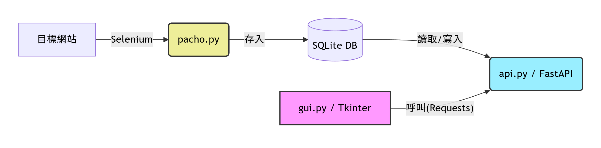
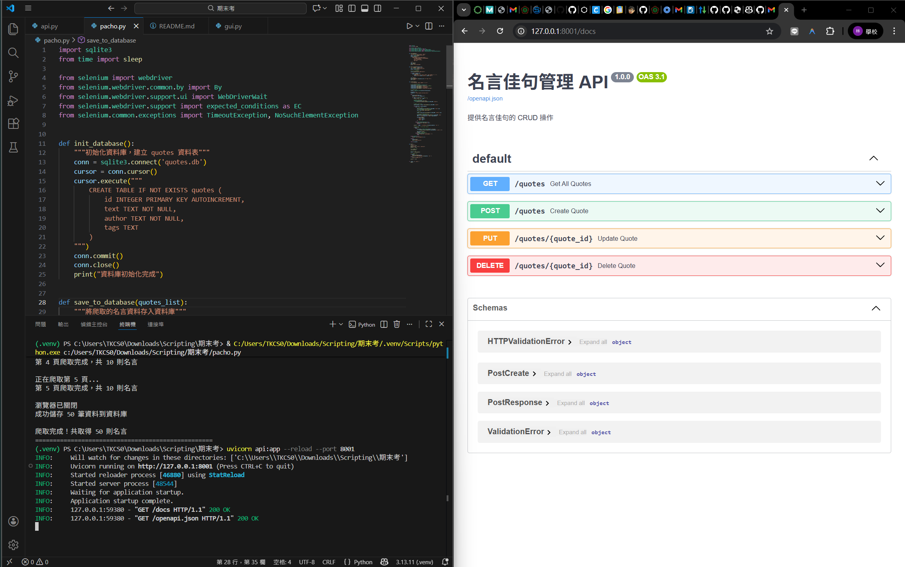
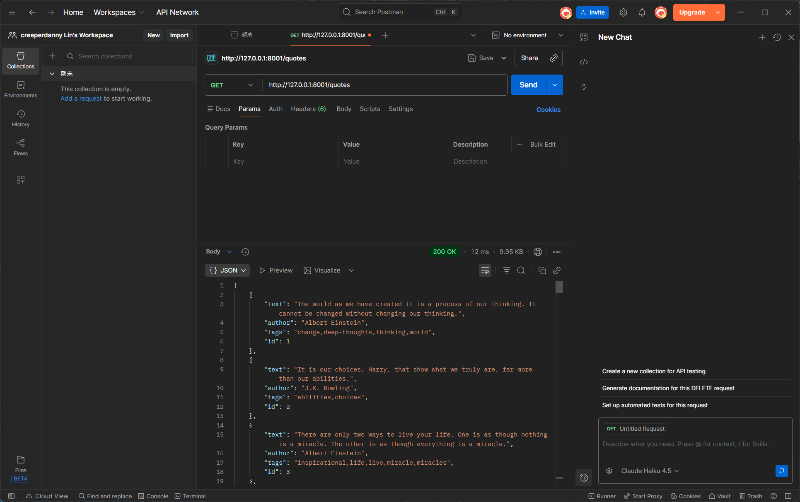
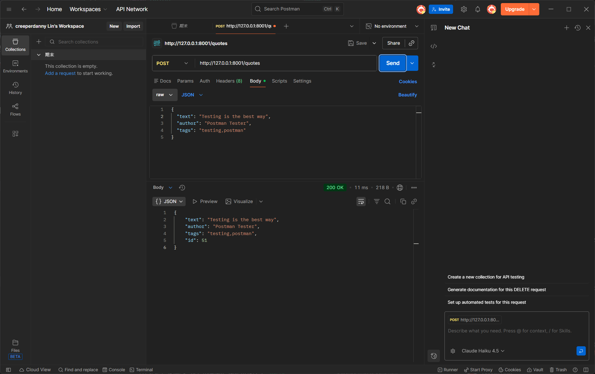
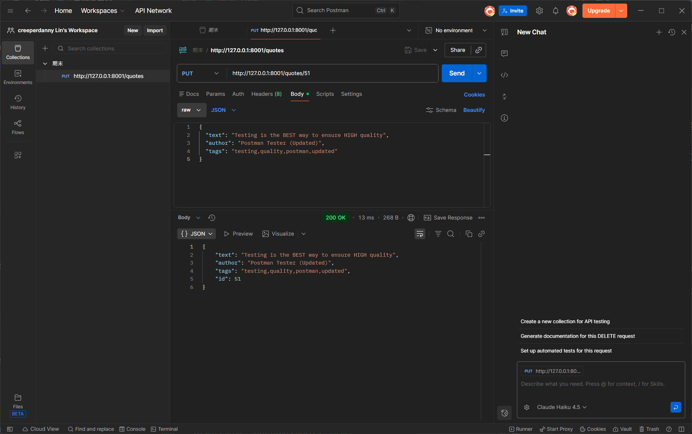
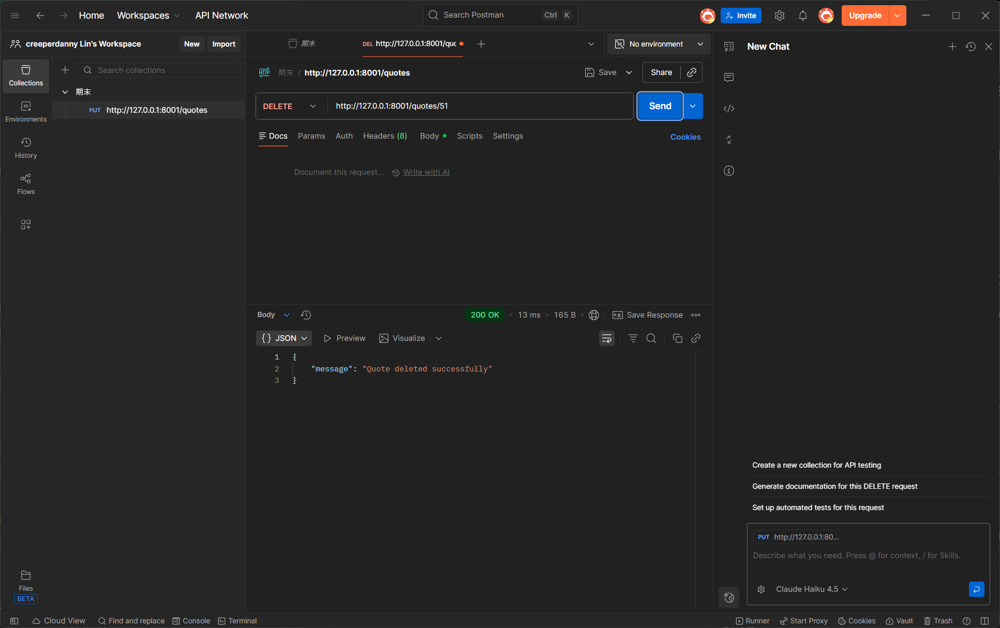
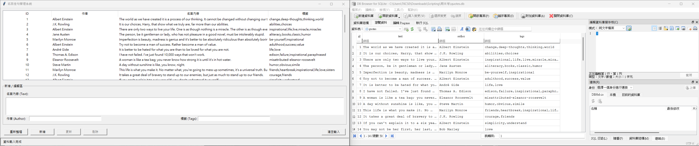

# 動態名言佳句管理系統

## 專案說明

此專案為 1141 Scripting 程式設計期末考作業。

## 系統架構



## 專案結構

```
final-exam-project/
├── pacho.py         # 爬蟲程式 (Selenium)
├── api.py           # 後端 API (FastAPI)
├── gui.py           # 前端介面 (Tkinter)
├── quotes.db        # 資料庫 (由 pacho.py 產生)
├── requirements.txt # 套件依賴清單
├── README.md        # 專案說明 (本檔案)
├── .gitignore       # Git 忽略清單
├── LICENSE          # 授權條款
└── img/             # 成果截圖資料夾
    ├── 系統架構.png
    ├── Swagger.png
    ├── GET.png
    ├── POST.png
    ├── PUT.png
    ├── PUT 404.png
    ├── DELETE.png
    ├── DELETE 404.png
    ├── GUI 視窗初始畫面.png
    ├── GUI 新增功能.png
    ├── GUI 更新功能.png
    ├── GUI 刪除功能.png
    ├── GUI API 未啟動時.png
    └── 驗證資料庫同步.png
```

## 環境需求

- Python 3.10+
- Chrome 瀏覽器 (Selenium 使用)

## 安裝步驟

1. **建立虛擬環境** (建議)
   ```bash
   python -m venv env
   env\Scripts\activate  # Windows
   ```

2. **安裝套件**
   ```bash
   pip install -r requirements.txt
   ```

## 執行流程

### 步驟 1: 執行爬蟲程式

```bash
python pacho.py
```

此步驟會：
- 使用 Selenium 爬取 http://quotes.toscrape.com/js/ 前 5 頁資料
- 自動建立 `quotes.db` 資料庫並存入約 50 筆名言資料

### 步驟 2: 啟動 API 伺服器

```bash
uvicorn api:app --reload
```

API 文件位址：http://127.0.0.1:8000/docs

### 步驟 3: 執行 GUI 程式

```bash
python gui.py
```

**注意**: 執行 GUI 時，API 伺服器必須保持開啟狀態。

## 功能說明

### pacho.py - 動態爬蟲

- 使用 Selenium 驅動 Chrome 瀏覽器 (headless 模式)
- 自動點擊 Next 按鈕進行換頁
- 擷取名言內容 (text)、作者 (author)、標籤 (tags)
- 資料存入 SQLite 資料庫

### api.py - FastAPI 後端

提供 RESTful API：

| 方法 | 端點 | 說明 |
|------|------|------|
| GET | /quotes | 取得所有名言 |
| POST | /quotes | 新增一則名言 |
| PUT | /quotes/{id} | 更新指定名言 |
| DELETE | /quotes/{id} | 刪除指定名言 |

### gui.py - Tkinter GUI

- **資料顯示區**: 使用 Treeview 顯示所有名言
- **編輯區**: 可輸入/修改名言內容、作者、標籤
- **操作按鈕**: 重新整理、新增、更新、刪除
- **狀態列**: 即時顯示操作狀態
- **多執行緒**: API 請求時視窗不會凍結

## 成果截圖

### API Swagger UI

執行 `uvicorn api:app --reload` 後，開啟 http://127.0.0.1:8000/docs



### API 操作示範

#### GET - 取得所有名言


#### POST - 新增名言


#### PUT - 更新名言


#### PUT 404 - 更新不存在的名言


#### DELETE - 刪除名言


#### DELETE 404 - 刪除不存在的名言


### GUI 介面

#### 初始畫面


#### 新增功能


#### 更新功能


#### 刪除功能


#### API 未啟動時的錯誤處理


### 資料庫同步驗證


## 授權

MIT License
